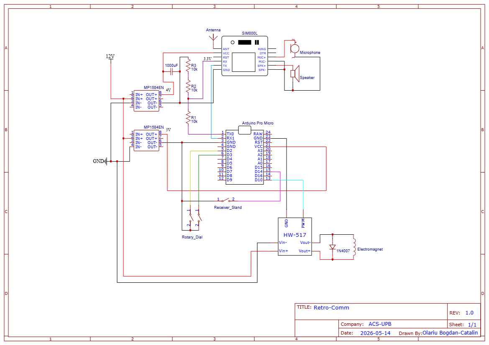
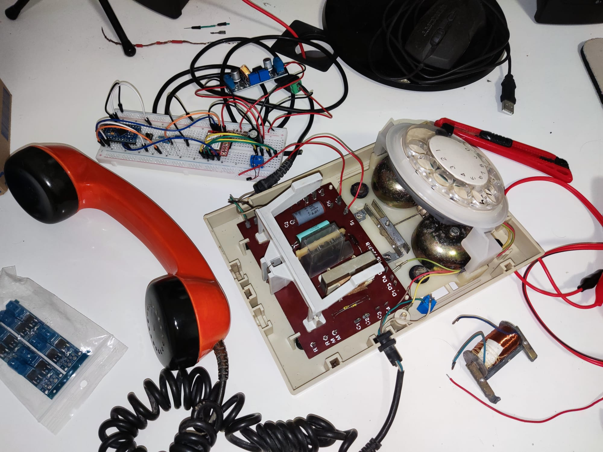

# Arduino Rotary Phone

## Introduction

* My goal with this project was to make an old rotary phone work again
* The phone should connect to a modern telephone network and be used reliably as a communication device
* It will have all of its old features working:
  *	rotary disc for selecting the phone number to be called
  *	ringing bells for incoming calls
  *	receiver being lifted to answer a call / initiate a call
* As well as some new features to give it a modern twist:
  *	ability to save important numbers in memory for faster calls
  *	custom ringtones

## Hardware design

## Software design

* The main parts of the code and the way they interact are:
  *	INT0 and INT1 interrupts used to count the digit being dialed by monitoring the changes in voltage generated by the disc on the associated pins
  *	Timer1 counts the milliseconds used as a clock for the whole system and counts the precise time (3ms) during which the electromagnet is being powered in order to give it just the right impulse (any more than 3ms could overheat the electromagnet, so using an interrupt for this was essential)
  *	PCINT0 on PB1 is used to detect whether or not the receiver is placed in its stand. A variable keeps track of its state, changing the way the phone is configured
  *	The UART functions ensure the communication between the Arduino and the SIM800L in order to initiate calls (ATD+<phone_number>), answer (ATA), hang up (ATH) or set initial conditions like mic/spk volume
  *	The different ringtones are stored in Flash using PROGMEM to avoid using SRAM unnecessarily. A ringtone is represented as an array of “pauses” representing the time between electromagnet impulses which move the hammer that hits the bell, making a sound. This way, a song can be represented simply as just the time between its main beats. A simple python script was used to convert a few RTTTL formatted songs in the format mentioned above. The selection of the current ringtone being used will be saved, just as the favorite phone numbers, in the EEPROM of the Arduino
  *	The main loop:
    1.	monitors what the sim module sends in order to determine if the phone should be ringing (as long as it receives the RING message) or the phone call ended (NO CARRIER message)
    2.	checks if a phone number has been fully dialed and then calls it by giving the ATD+<phone_number> command
    3.	ends calls when the receiver is placed back in the stand
    4.	answers calls when the receiver is lifted up
    5.	plays the ringtone for as long as RING messages are coming from the sim module
    6.	processes commands from the user (save a new favorite number, call a saved number, change ringtone)

* Libraries used / framework
  *	PlatformIO was used for compiling and uploading the code to the Arduino
  *	I used the standard avr libraries like io.h, interrupt.h, as well as a custom simple UART library and string.h for basic string manipulation

## Results

[Video demonstration](https://drive.google.com/file/d/10iQ6GrdkpwepECf6__DSMxAaQTF0TzT-/view?usp=sharing)
